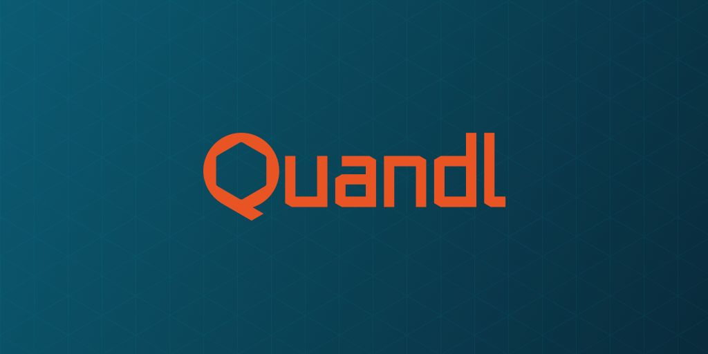

# **Case Study of Quandl**

## [Overview and Origin](https://blog.revolutionanalytics.com/2013/02/quandl-a-wikipedia-for-time-series-data.html)

Quandl is a platform in the Financial Data Marketplaces & Alternative Data Marketplaces & Platforms area. *Quandl lnc.* was incorporated in Sept 1st, 2011 and headquartered in Canada. Quandl is the premier source for financial, economic, and alternative datasets, serving investment professionals. Quandl has 33 integrations with data vendors such as AlgoSeek and The Applied Research Company. Quandl’s platform is used by over 400,000 people, including analysts from the world’s top hedge funds, asset managers and investment banks.

Quandl was founded by Abraham Thomas and Tammer Kamel. [Abraham Thomas](https://www.crunchbase.com/person/abraham-thomas) is Quandl’s co-founder and Chief Data Officer. An expert data analyst, Abraham handles all data-related operations for Quandl: identification, acquisition, curation, organization and dissemination. Abraham co-founded Quandl after a successful career on Wall Street, where he was the youngest trader at a multi-billion-dollar hedgefund. At this fund, Abraham conceived, designed and executed a number of quantitative data-driven investment strategies while managing a $300m arbitrage portfolio. [Tammer Kamel](https://www.crunchbase.com/person/tammer-kamel) is Quandl’s founder and CEO. Tammer created Quandl to solve a problem he encountered again and again in his 15-year career in finance: the time, effort and resources required to acquire and prepare data for analysis. Tammer programmed the first version of Quandl with the goal of making it easy for anyone to find and use high-qualitydata effectively in their professional decision-making.

Finding and formatting numerical data for analysis in R or Excel or indeed any application is a pain that all real world data analysts know all too well.  The solution to this problem is conceptually obvious: one site with all the world’s data, nicely formatted and documented; an omni-platform. The result is [www.quandl.com](https://demo.quandl.com/) as sort of "search engine" for numerical data.  The idea with Quandl is that you can find data fast.

Quandl has raised a total of CA$20.4M in funding over 4 rounds. Their latest funding was raised on Aug 6, 2018 from a Venture [(1)](https://www.crunchbase.com/organization/quandl/company_financials).

## Business Activities:

Quandl is a platform that offers economic, financial, and alternative datasets to its users. Users can download free data, buy paid data or sell data to Quandl. 
- Core Financial Data. Quandl delivers market data from hundreds of sources via API, or directly into Python, R, Excel and many other tools. Save time and money by getting the data you need in the format you want.
- Alternative Data. Quandl brings undiscovered data from non-traditional publishers to investors seeking unique, predictive insights. Quandl leverages exclusive relationships to deliver these alpha-generating datasets to its customers.

Financial analyst have probably spent weeks of my life trying to find data on the web.  And several more weeks validating, formatting and cleaning the data.  Analysis offers data scientists interesting, intellectually stimulating problems.  But data acquisition, the necessary precursor, offers only tedium and pain.  It's a time vampire. Quandl has built a sort of "universal data parser" which has thus far parsed about 2.8 million datasets. 

Quandl's platform is used by over 400,000 people, including analysts from the world's top hedge funds, asset managers and investment banks. Housands of investment firms and businesses use Quandl every day to power their data-driven strategies. 

Stripe Connect, MuleSoft Anypoint Platform, TrueLayer, and Merge are the most popular alternatives and competitors to Quandl. 

**Quandl's Strengths:**
- Quandl provides an enormous collection of data (over 20 million datasets).
- All datasets are accessible for instantaneous download in any preferred format.
- All datasets on Quandl are accessible through the same API, irrespective of who originally published the data or in what format.
- Data is transparent.
- Datasets are clean and easy to locate.
- Some sections of Quandl are free and open for everyone.
- New data is added every week.
- We can utilize Quandl in many programs (Excel, R, Python, Ruby, MATLAB, and more).
- We can utilize Quandl to sell the data.

**Quandl's Weaknesses:**
- There are many exotic datasets that are not free.
- They provide limited amounts of support while constructing analyses or discovering information.
- Quandl is not much beginner-friendly.
- They do not have real-time or delayed stock price data.
- They do not have a master security list.

The data of Quandl comes in two formats: The first being the Time series and the second being the Tables. The Time series data like FRED is composed of a large number of individual time series where each of them has its Quandl code added on to the main Quandl code. For example, US civilian unemployment rate: FRED/UNRATE. On the contrary, the Table data like SF1 consist of single or multiple tables where each of them has its Quandl code. For example, the Quandl code for the Core US Fundamentals table is SHARADAR/SF1. Quandl offers a wide range of tools for Data Analysis which includes API, Python, R, Excel, Ruby, and many more.

## Landscape:

Quandl is a powerful big data platform that support financial analysis and investment decisions making.

The last decade, of course, was the era of big data. New data sources such as online clickstreams required a variety of new hardware offerings on premise and in the cloud, primarily involving distributed computing — spreading analytical calculations across multiple commodity servers — or specialized data appliances. Such machines often analyze data “in memory,” which can dramatically accelerate times-to-answer. Cloud-based analytics made it possible for organizations to acquire massive amounts of computing power for short periods at low cost. Even small businesses could get in on the act, and big companies began using these tools not just for big data but also for traditional small, structured data.

Along with the hardware advances, the need to store and process big data in new ways led to a whole constellation of open source software, such as Hadoop and scripting languages. Hadoop is used to store and do basic processing on big data, and it’s typically more than an order of magnitude cheaper than a data warehouse for similar volumes of data. Today many organizations are employing Hadoop-based data lakes to store different types of data in their original formats until they need to be structured and analyzed.

Since much of big data is relatively unstructured, data scientists created ways to make it structured and ready for statistical analysis, with new (and old) scripting languages like Pig, Hive, and Python. More-specialized open source tools, such as Spark for streaming data and R for statistics, have also gained substantial popularity. The process of acquiring and using open source software is a major change in itself for established businesses.
The technologies I’ve mentioned for analytics thus far are primarily separate from other types of systems, but many organizations today want and need to integrate analytics with their production applications. They might draw from CRM systems to evaluate the lifetime value of a customer, for example, or optimize pricing based on supply chain systems about available inventory. In order to integrate with these systems, a component-based or “microservices” approach to analytical technology can be very helpful. This involves small bits of code or an API call being embedded into a system to deliver a small, contained analytical result; open source software has abetted this trend.

This embedded approach is now used to facilitate “analytics at the edge” or “streaming analytics.” Small analytical programs running on a local microprocessor. With internet of things data becoming popular in many industries, analyzing data near the source will become increasingly important, particularly in remote geographies where telecommunications constraints might limit centralization of data.

Another key change in the analytics technology landscape involves autonomous analytics — a form of artificial intelligence or cognitive technology. Analytics in the past were created for human decision makers, who considered the output and made the final decision. But machine learning technologies can take the next step and actually make the decision or adopt the recommended action. Most cognitive technologies are statistics-based at their core, and they can dramatically improve the productivity and effectiveness of data analysis.

However, these new tools are also more complex and in many cases require higher levels of expertise to work with. As analytics has grown in importance over the last decade, the commitments that organizations must make to excel with it have also grown. Because so many companies have realized that analytics are critical to their business success, new technologies haven’t necessarily made it easier to become — and remain — an analytical competitor. Using state-of-the-art analytical technologies is a prerequisite for success, but their widespread availability puts an increasing premium on nontechnical factors like analytical leadership, culture, and strategy.

Bloomberg, Exchange Data International, xignite, and FinPricing are the top competitors and alternatives to Quandl.

## Results

Quandl has had a significant impact on the financial industry. Some of the ways in which Quandl has impacted the industry include:

Access to data: Quandl has made it easier for financial professionals to access a wide range of financial data. The company's platform offers access to millions of financial, economic, and alternative data sets from a variety of sources, including central banks, exchanges, and alternative data providers.

Data analysis: Quandl's platform includes powerful tools for analyzing and visualizing financial data. These tools allow users to quickly identify trends and patterns in the data, and to use this information to inform their investment decisions.

Alternative data: Quandl has been at the forefront of the trend toward using alternative data sources in investment analysis. The company has made it easier for investors to access and analyze non-traditional data sources, such as satellite imagery, social media, and web traffic data.

Partnership with Nasdaq: Quandl's acquisition by Nasdaq has provided the company with greater resources and access to a wider range of data. This partnership has allowed Quandl to expand its offerings and to reach a broader audience.

Overall, Quandl has had a significant impact on the financial industry by making it easier for financial professionals to access and analyze a wide range of data. Its acquisition by Nasdaq has further strengthened its position in the market, and its offerings are likely to continue to play an important role in the financial industry.

core metrics that Quandl may use to measure success in their domain of financial data provision.

- Number of subscribers: One of the key metrics for Quandl is likely the number of subscribers to their platform. This includes individual investors, hedge funds, asset managers, banks, and other financial institutions that use Quandl's data to inform their investment decisions.

- Data coverage: Quandl may also measure the success of its platform by the number and range of data sets it provides. This includes both traditional financial data (such as stock prices and economic indicators) as well as alternative data (such as social media sentiment and satellite imagery).

- User engagement: Another metric that Quandl may track is user engagement on their platform. This includes metrics such as time spent on the platform, number of searches performed, and number of downloads.

- Revenue: Of course, revenue is an important metric for any business, and Quandl is likely no exception. The company may track its revenue from subscriptions, data sales, and other sources.

- Partnerships and collaborations: Quandl may also measure its success based on its partnerships and collaborations with other companies in the financial industry. These partnerships can help expand Quandl's reach and provide access to additional data sets.

Quandl is one of several companies that provide financial and alternative data to investors, traders, and other financial professionals. Other companies in this space include Bloomberg, Refinitiv, FactSet, and Yewno. Each of these companies offers a range of data sets and analysis tools to their customers, and competition is intense.

Quandl has established a reputation as a leading provider of alternative data, which includes non-traditional sources such as satellite imagery, social media, and web traffic data. The company has also differentiated itself by providing easy-to-use data analysis tools and a flexible API that allows developers to integrate Quandl's data into their own applications.

Quandl's acquisition by Nasdaq in 2018 has further strengthened its position in the market. The acquisition has allowed Quandl to leverage Nasdaq's resources and expertise, as well as its own data offerings, to provide more comprehensive solutions to its customers.

Overall, Quandl is well-positioned in the financial data provision space, but the competition in this market is intense, and the industry is constantly evolving. Quandl will need to continue to innovate and adapt to changing market conditions in order to maintain its position as a leading provider of financial and alternative data.

## Recommendations

* If you were to advise the company, what products or services would you suggest they offer? (This could be something that a competitor offers, or use your imagination!)
 products or services that Quandl may consider offering in the future:

Enhanced analytics: Quandl's platform already includes powerful tools for analyzing and visualizing financial data, but there is always room for improvement. Quandl may consider investing in the development of more advanced analytics tools, such as machine learning algorithms or predictive analytics, that can help investors make more informed decisions.

Data customization: Quandl offers access to a wide range of financial and alternative data sets, but some customers may have specific data needs that are not currently met. Quandl may consider offering more customization options, allowing customers to tailor their data sets to their specific requirements.

Industry-specific solutions: While Quandl's data sets are relevant to a wide range of industries, there may be opportunities to develop more targeted solutions for specific industries or use cases. For example, Quandl could develop data sets and tools specifically for the real estate or healthcare industries.

Integration with other platforms: Quandl's API already allows developers to integrate Quandl's data into their own applications, but there may be opportunities to develop more seamless integrations with other popular platforms in the financial industry.

Educational resources: Quandl's platform is already user-friendly, but the company may consider offering more educational resources, such as webinars, tutorials, and case studies, to help customers get the most out of their data sets and analysis tools.

These are just a few potential suggestions for products or services that Quandl could consider offering in the future. Ultimately, the specific products or services that Quandl chooses to develop will depend on a variety of factors, including customer needs, market trends, and available resources.

* Why do you think that offering this product or service would benefit the company?
Quandl's existing product offerings, such as its financial and alternative data sets and analysis tools, have already proven to be successful, with a large and growing user base of investors, traders, and other financial professionals. However, there are several reasons why Quandl might benefit from expanding its product or service offerings:

Increased revenue: Offering new products or services could open up new revenue streams for Quandl, allowing the company to diversify its sources of income and reduce its reliance on any one particular offering.

Customer retention: Expanding its product offerings could help Quandl retain existing customers and attract new ones, by providing more value and more tailored solutions to meet their specific needs.

Competitive differentiation: The financial data provision market is highly competitive, and expanding its product or service offerings could help Quandl differentiate itself from competitors and establish a more distinct value proposition.

Future-proofing: The financial industry is constantly evolving, and Quandl will need to adapt to changing market conditions in order to remain relevant. Offering new products or services could help Quandl stay ahead of emerging trends and remain competitive in the long term.

Overall, expanding its product or service offerings could help Quandl continue to grow and succeed in the competitive financial data provision market. However, any new offerings would need to be carefully researched and developed to ensure that they are aligned with customer needs and are economically viable.

* What technologies would this additional product or service utilize?
The technologies that Quandl might utilize for any additional product or service offerings would depend on the specific nature of the offering. However, based on Quandl's existing products and industry trends, there are several technologies that the company might consider incorporating:

Artificial Intelligence (AI) and Machine Learning (ML): AI and ML technologies can be used to develop more advanced analytics and predictive models, allowing Quandl to offer more sophisticated data analysis tools to its customers.

Cloud Computing: Cloud computing can provide a scalable and cost-effective infrastructure for storing and processing large volumes of financial data, which is critical for Quandl's existing products and any potential new offerings.

Blockchain: Blockchain technology can be used to securely store and share financial data, which could be particularly relevant for Quandl's alternative data offerings.

Natural Language Processing (NLP): NLP can be used to extract insights from unstructured data sources, such as news articles or social media posts, which is a key feature of Quandl's alternative data sets.

Application Programming Interfaces (APIs): APIs are already a key part of Quandl's existing platform, but the company may consider developing more advanced and customizable APIs that allow for seamless integration with other financial software and platforms.

Ultimately, the specific technologies that Quandl might utilize would depend on the needs of its customers, the competitive landscape, and the company's own resources and expertise.

* Why are these technologies appropriate for your solution?
AI: AI and machine learning technologies can be used to develop more sophisticated data analysis tools and predictive models, which can provide Quandl's customers with more valuable insights and help them make more informed decisions.

Cloud computing: Cloud computing provides a scalable and cost-effective infrastructure for storing and processing large volumes of financial data, which is critical for Quandl's existing products and any potential new offerings. Additionally, cloud computing can enable Quandl to offer more flexible pricing models, as customers can pay for only the resources they need.

Blockchain: Blockchain technology can be used to securely store and share financial data, which is particularly relevant for Quandl's alternative data sets. This can help to ensure data integrity and confidentiality, while also providing a distributed and decentralized platform for data sharing.

NLP: NLP can be used to extract insights from unstructured data sources, such as news articles or social media posts, which is a key feature of Quandl's alternative data sets. This can help Quandl's customers to gain a more complete and nuanced understanding of market trends and sentiment.

APIs: APIs are already a key part of Quandl's existing platform, and expanding their functionality and customization options can enable seamless integration with other financial software and platforms. This can help Quandl to broaden its customer base and increase its value proposition for existing customers.

Overall, these technologies are appropriate for Quandl to utilize for additional product or service offerings because they can help the company to improve its existing offerings, differentiate itself from competitors, and provide customers with more valuable and customizable solutions. Additionally, these technologies are widely used and well-established in the financial industry, making them a natural fit for Quandl's core business.

